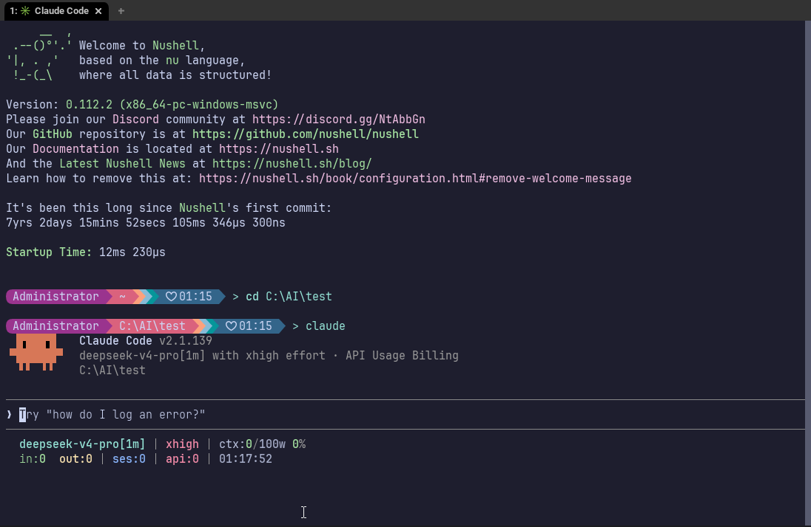
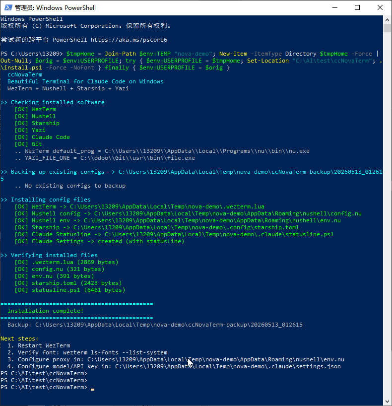
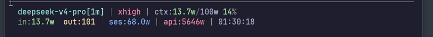

# ccNovaTerm

> **C**laude **C**ode + **Nova** **Term**inal — One command, fully equipped terminal for Claude Code

[](./README.md)
[](./README_CN.md)

An automated setup that bundles [WezTerm](https://wezfurlong.org/wezterm/) + [Nushell](https://www.nushell.sh/) + [Starship](https://starship.rs/) + [Yazi](https://yazi-rs.github.io/) into the perfect terminal experience for Claude Code.



## ✨ Features

- 🚀 **One-command setup** — Single command, full configuration
- 🎨 **Catppuccin Mocha** — Unified theme across WezTerm and Starship
- 🔤 **Nerd Font** — JetBrainsMono Nerd Font, ready to use
- 🐚 **Nushell** — Modern structured shell, with `cc` alias for instant Claude Code access
- 📁 **Yazi** — Terminal file manager, seamlessly integrated
- 🔄 **config-sync** — Claude Code skill for bidirectional config sync

## 📋 Prerequisites

| Tool | Description |
|------|-------------|
| [WezTerm](https://wezfurlong.org/wezterm/) | GPU-accelerated terminal emulator |
| [Nushell](https://www.nushell.sh/) | Structured shell |
| [Starship](https://starship.rs/) | Customizable shell prompt |
| [Yazi](https://yazi-rs.github.io/) | Terminal file manager |
| [Claude Code](https://docs.anthropic.com/en/docs/claude-code) | AI coding assistant CLI |
| [Git for Windows](https://git-scm.com/) | Version control (Windows needs `file.exe` from `usr/bin`) |
| [JetBrainsMono Nerd Font](https://www.nerdfonts.com/font-downloads) | Icon and symbol support |

## 🚀 Install

### Windows

```powershell
git clone https://github.com/shuiyu486/ccNovaTerm.git
cd ccNovaTerm
.\install.ps1
```

### macOS

```bash
git clone https://github.com/shuiyu486/ccNovaTerm.git
cd ccNovaTerm
./install.sh
```

The installer will:
1. Detect all prerequisites
2. Replace placeholders in config templates with actual system paths
3. Deploy config files to the correct locations
4. Install locked Yazi plugins from `package.toml`
5. Back up any existing configs

## 📁 Project Structure

```
ccNovaTerm/
├── config/           ← Config templates
│   ├── .wezterm.lua  ← WezTerm config (Catppuccin Mocha theme)
│   ├── config.nu     ← Nushell config (aliases, Yazi integration)
│   ├── env.nu        ← Nushell environment variables
│   ├── starship.toml ← Starship prompt (Pastel Powerline)
│   ├── yazi/         ← Yazi config and plugin lockfile
│   └── CLAUDE.local.md ← Project-level Claude Code instructions
├── docs/             ← Screenshots
├── test/             ← Test scripts
├── install.ps1       ← Windows installer
├── install.sh        ← macOS installer
└── CLAUDE.local.md   ← This file
```

## 🔄 config-sync Skill

ccNovaTerm includes a [Claude Code skill](https://docs.anthropic.com/en/docs/claude-code/skills) for bidirectional config sync between your local environment and project templates.

### Install

```bash
/plugin install config-sync
```

### Usage

Just tell Claude Code:

| Command | Action |
|---------|--------|
| "Sync to local" | Project templates → local configs |
| "Sync to project" | Local configs → project templates |
| "Compare" | Show diffs between local and templates |
| "Quick check" | Verify config compatibility |

### Placeholders

Templates use placeholders that are auto-replaced with actual system paths during install:

| Placeholder | Replaced with |
|-------------|--------------|
| `__NU_PATH__` | Full path to Nushell executable (Windows) or `'nu'` (macOS) |
| `__GIT_USR_BIN__` | `usr/bin` path under Git install directory |

## 🛠️ Customization

All config files are standard and can be edited directly:

- **WezTerm**: Edit `~/.wezterm.lua` — font, colors, keybindings
- **Nushell**: Edit `~/AppData/Roaming/nushell/config.nu` (Windows) or `~/Library/Application Support/nushell/config.nu` (macOS)
- **Starship**: Edit `~/.config/starship.toml` — prompt style and modules
- **Environment**: Edit `~/AppData/Roaming/nushell/env.nu` (Windows) or `~/Library/Application Support/nushell/env.nu` (macOS)
- **Yazi**: Edit `~/AppData/Roaming/yazi/config/*.toml` (Windows) or `~/.config/yazi/*.toml` (macOS); plugin dependencies are locked in `package.toml` and restored with `ya pkg install`

After changes, use config-sync's "Sync to project" to push them back to templates.

## 📸 Screenshots





## 📄 License

MIT License — See [LICENSE](LICENSE) for details.